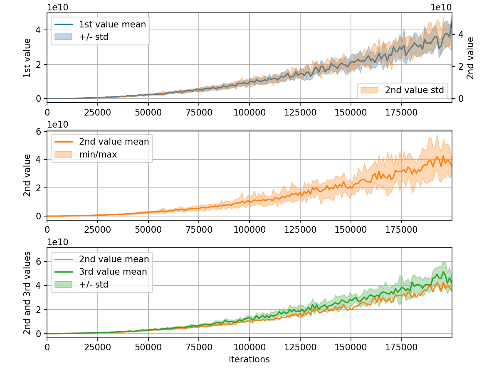

# convergence_logger.py

A Python package to monitor and visualize the convergence of machine learning algorithms by tracking statistics over time.

## Features

- **Time Compression**: Automatically aggregates data into a fixed number of time intervals to manage memory.
- **Statistical Tracking**: Computes count, min, max, mean, variance, and standard deviation on the fly.
- **Visualization**: Built-in methods for easy plotting with `matplotlib`.

## Installation

Create a local environment and install `convergence_logger` and its dependencies using `pip`:

    ```bash
    python -m venv .venv
    source .venv/bin/activate
    pip install git+https://github.com/hespanha/ConvergenceLogger.py
    ```

## Usage Example

The following example demonstrates how to use `LoggerStatistics` to track and visualize three
different metrics over time and produces the following plot. 



```python
from convergence_logger import LoggerStatistics, CountMinMaxMeanVarStd
import matplotlib.pyplot as plt
import numpy as np

# Logger configuration
n_values = 3  # Track 3 different metrics
n_intervals = 200  # Compress time into 200 intervals
stats = CountMinMaxMeanVarStd()
logger = LoggerStatistics(stats, n_intervals, n_values)

# Create figure and axes for plots
fig, axes = plt.subplots(3, 1, figsize=(10, 8))
ax = list(axes)
for a in ax:
    a.grid(True)

ax[0].set_ylabel("1st value")
ax[1].set_ylabel("2nd value")
ax[2].set_ylabel("2nd and 3rd values")
ax[2].set_xlabel("iterations")
# Add a twin axis for the 1st plot to show two different metrics
ax.append(ax[0].twinx())
ax[3].set_ylabel("2nd value")

plt.tight_layout()

for iteration in np.linspace(0, 10000, 2000):
    # Add values to the logger (simulated data)
    logger.add_value(
        float(iteration),
        [
            0.9 * (3.0 + iteration * (1.0 + 0.1 * np.random.randn())) ** 2,
            1.0 * (iteration * (1.0 + 0.1 * np.random.randn())) ** 2,
            1.2 * (-3.0 + iteration * (1.0 + 0.1 * np.random.randn())) ** 2,
        ],
    )

    if iteration % 1000 == 0 or iteration == 100 * (10 * n_intervals - 1):
        # Update the plots every 1000 iterations (and at the last iteration)

        # clear previous data from the axes
        for a in ax:
            logger.plot_remove(a)

        # Plot mean/std for the 1st value (left), and std for the 2nd value (right)
        logger.plot(stats.plot_mean_std, ax[0], 0, color="C0", label="1st value mean")
        logger.plot(stats.plot_std, ax[3], 1, color="C1", label="2nd value std")

        # Plot mean and range for the 2nd value
        logger.plot(stats.plot_mean_range, ax[1], 1, color="C1", label="2nd value mean")

        # Plot mean/std for the 3rd value and mean for the 2nd value
        logger.plot(stats.plot_mean_std, ax[2], 2, color="C2", label="3rd value mean")
        logger.plot(stats.plot_mean, ax[3], 1, color="C1", label="2nd value mean")

        # Finalize layout
        ax[0].legend(loc="upper left")
        ax[1].legend(loc="upper left")
        ax[2].legend(loc="upper left")
        ax[3].legend(loc="lower right")

        # force redraw
        fig.canvas.draw()
        fig.canvas.flush_events()
        plt.pause(0.0001)
```
